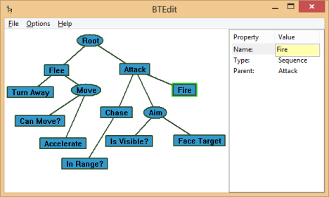

BTEdit
======

An Open Source Behavior Tree Editor and Designer supporting creation of and embeding AI scripts.

## Getting Started ##

For Windows, prebuild biniaries are provided. Linux and Mac users can run the source on top of [wxPython]("www.wxpython.org/‎").

### Editing Behavior Trees ###

To select a node, left click. To Remove a node, right click and select 'Delete Node', likewise for adding nodes.
The properties are shown in the right panel, with the name and type being editable. If the Type is set to "Selector" it will appear ellipse shaped on the graph. More shapes will be added, but for now only rectangles and ellipes are available.

### Exporting to cpp ###

BTEdit supports cpp code generation. In the future, a companion library will be released alongside BTEdit to allow for a more seamless development experience.

Icon Licensed under Creative Commons Attribution-ShareAlike 3.0 Unported, Authored by http://rrze-icon-set.berlios.de/index.html
